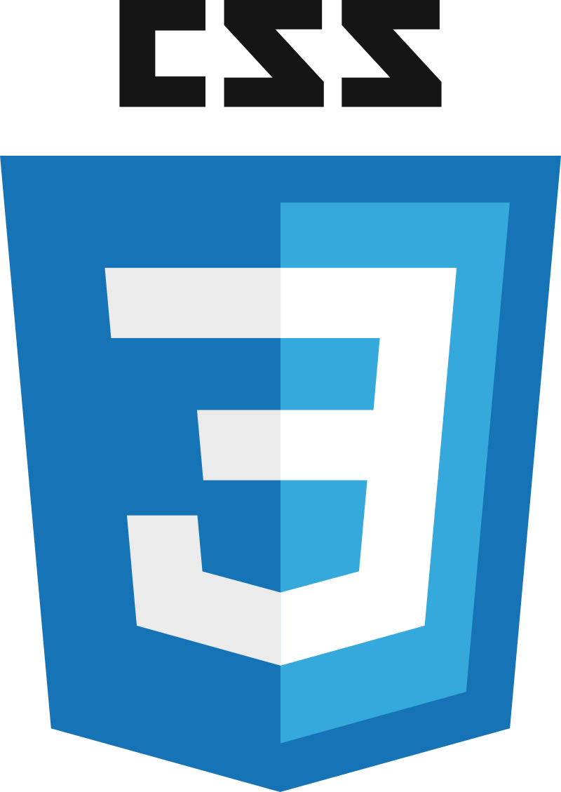
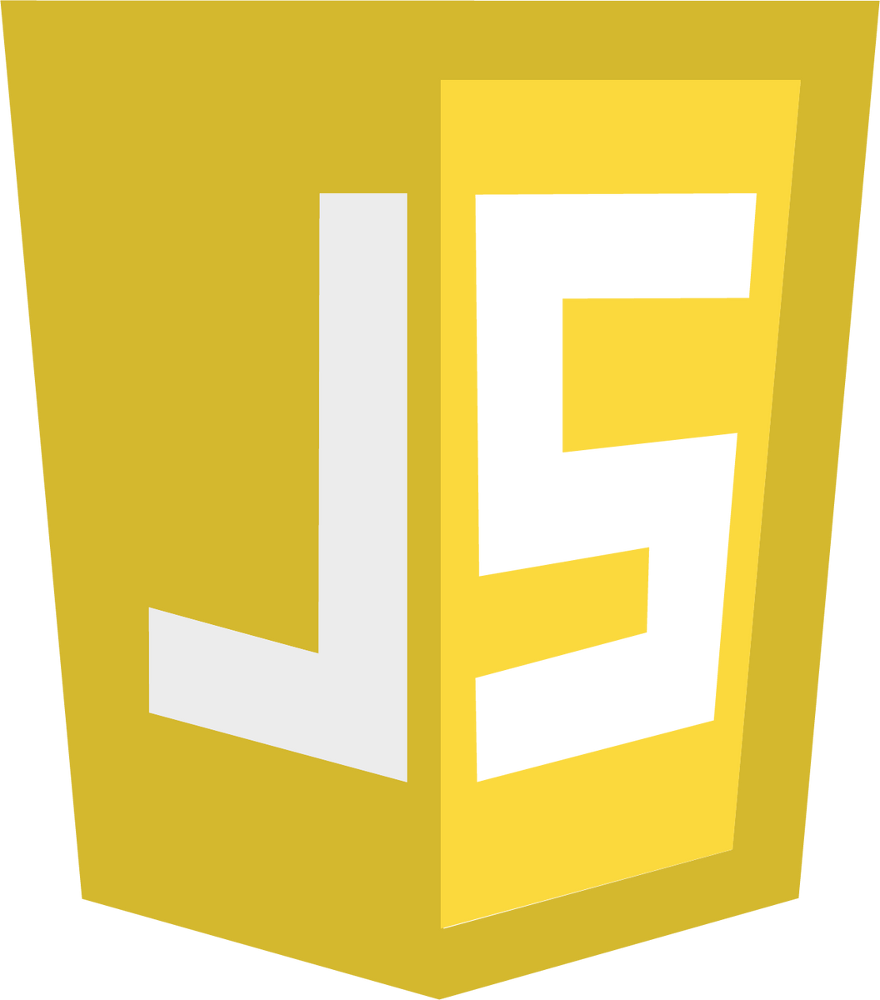
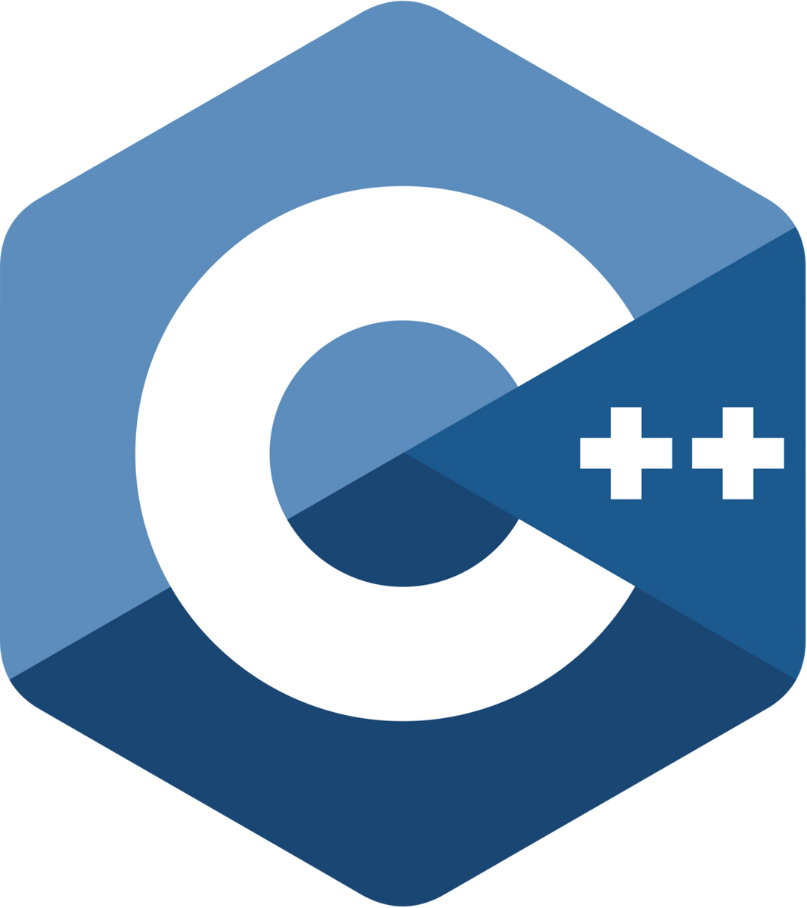

<h1 align="center">Hello, friend </h1>

  
Someone told me that I could do it, so here I am, on my Sophomore year as a [Software Engineering](https://www.uma.es/grado-en-ingenieria-del-software/) student 👨‍🎓 at [UMA](https://www.uma.es). I'm also a SysAdmin 🖥️ who enjoys streaming and testing games~
  

  
## Interests 📋
- Backend development 📡
- Clean Code & Coding ethics 🤓
- Testing/QA games & Bug hunting 🐛
- Cybersecurity 🕵️ 

 

## Some of the things I know 🤯

 

## Check out my repos 🎉

 
  
   
  

<!-- Special mentions

Whist: he got me into this mess "give it a few days at very least"
  https://github.com/whistmxl

Quirinus: he kept me in this mess (rip, he civilized now)
  https://github.com/Quirinus)

-->